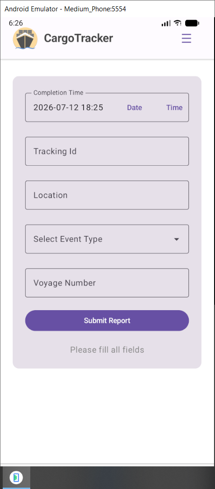
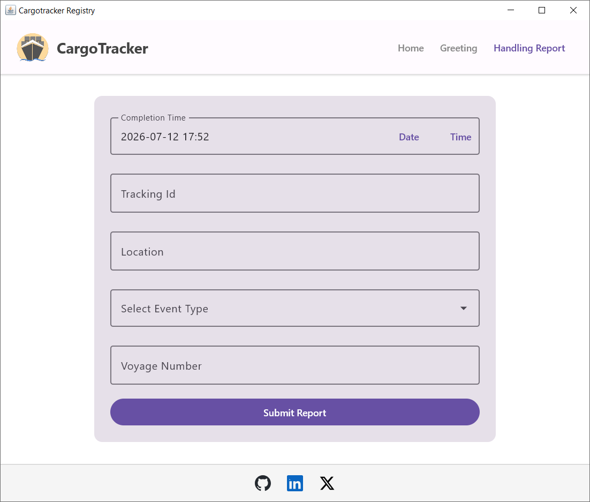
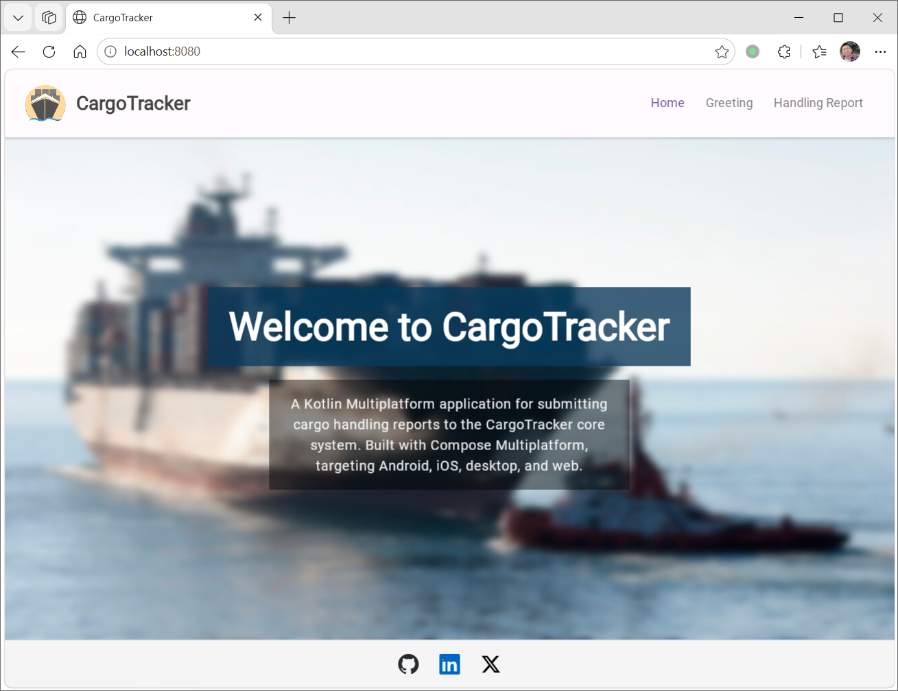
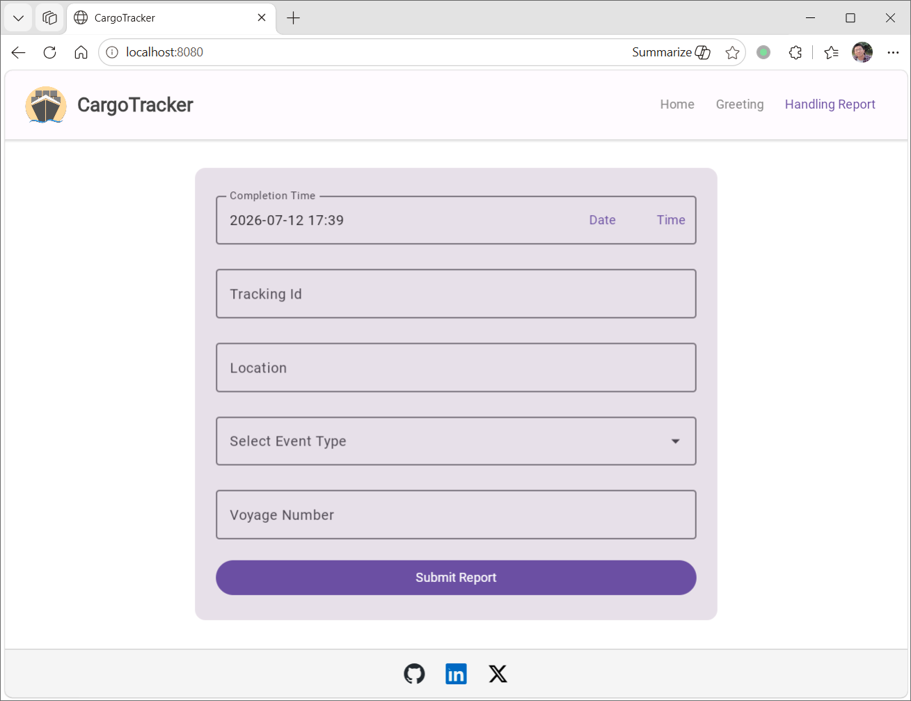

# CargoTracker RegApp (Kotlin Multiplatform)

The [original sample application](https://github.com/citerus/dddsample-regapp) from the DDD book was built with Swing and Spring. It served as a frontend for submitting handling event reports to the [CargoTracker core system](https://github.com/hantsy/cargotracker), which is itself a fork of [eclipse-ee4j/cargotracker](https://github.com/eclipse-ee4j/cargotracker).

I previously developed two JavaFX-based variants:

* [CargoTracker RegApp (JavaFX)](https://github.com/hantsy/cargotracker-regapp-javafx)
* [CargoTracker RegApp (Quarkus JavaFX)](https://github.com/hantsy/cargotracker-regapp-quarkus-javafx)

This project reimplements the same functionality using Kotlin Multiplatform, targeting Android, iOS, desktop (JVM), the web, and potentially other platforms down the road.

> [!WARNING]
> I'm new to Kotlin Multiplatform. The code may not be idiomatic — much of it was generated with the help of Google Gemini after working through the [Quick Start](https://kotlinlang.org/docs/multiplatform/quickstart.html) guide.

## Screenshots

**Android app running on Android Emulator**



**Desktop application running on Windows**



**Web application (Edge browser)**





## Project Structure

* **`sharedUI`** (`./sharedUI/src`) — Contains code shared across all Kotlin modules. This module replaces the previous `composeApp` hierarchy and is organized into several source sets:
  * `commonMain` (`./sharedUI/src/commonMain/kotlin`) — Platform-agnostic code.
  * Platform-specific sets (`iosMain`, `androidMain`, `jvmMain`, `jsMain`, etc.) — Platform-dependent APIs. For example, iOS-specific logic lives in `iosMain`, while desktop (JVM) code goes in `jvmMain`.

* **`client`** (`./client`) — Implements the HTTP client layer for remote API calls. This module encapsulates networking, serialization, and request/response models, keeping UI concerns separate.

* **`webApp`** (`./webApp`) — Hosts the web frontend, built with Compose for Web. Depends on `sharedUI` for shared business logic.

* **`desktopApp`** (`./desktopApp`) — Provides the desktop (JVM) application entry point, using Compose for Desktop and reusing shared logic from `sharedUI`.

* **`androidApp`** (`./androidApp`) — Contains the Android application: sources, layouts, and Gradle configuration.

* **`iosApp`** (`./iosApp`) — Holds the iOS application launcher. Native SwiftUI views or other platform-specific components are added here as needed.

## Building and Running

### Android

Use the IDE run configuration or run Gradle directly:

```bash
# macOS / Linux
./gradlew :androidApp:assembleDebug

# Windows
.\gradlew.bat :androidApp:assembleDebug
```

### Desktop (JVM)

Launch the desktop application from your IDE or the command line:

```bash
# macOS / Linux
./gradlew :desktopApp:run

# Windows
.\gradlew.bat :desktopApp:run
```

### Web

For the `webApp` module (Compose for Web), start the development server:

```bash
# macOS / Linux
./gradlew :webApp:browserDevelopmentRun

# Windows
.\gradlew.bat :webApp:browserDevelopmentRun
```

### iOS

Open the `iosApp` directory in Xcode or use an IDE run configuration for iOS. Build and run from Xcode as usual.

> **Note:** No iOS screenshot is available yet.
